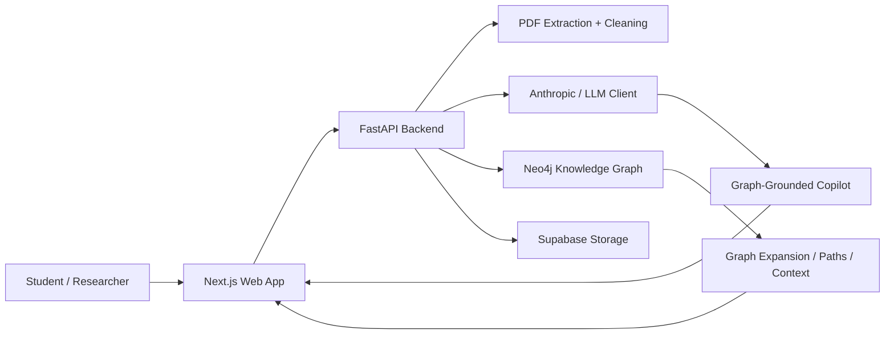
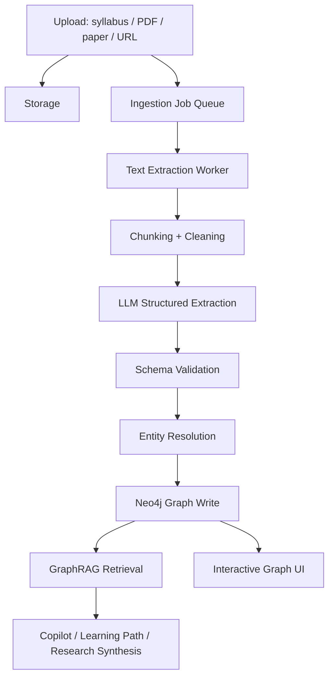

# MindMesh AI — Strategic Product, Hackathon, Investor & Demo Report

**Date:** July 7, 2026  
**Current market focus:** India-first, global-ready  
**Working tagline:** **Google Maps for Knowledge**  
**Product category:** AI learning + research operating system powered by knowledge graphs, GraphRAG, document intelligence, and interactive visual exploration.

---

## 1. Executive Summary

MindMesh AI is a knowledge graph web platform that turns educational material, syllabi, PDFs, research papers, notes, highlights, and citations into an explorable visual map. Instead of asking students and researchers to work through disconnected PDFs, browser tabs, bookmarks, notes, and chatbots, MindMesh gives them a spatial understanding layer: every concept, paper, author, citation, highlight, and learning dependency becomes a node in a live graph.

The central idea is simple and powerful:

> Most AI tools answer one question at a time. MindMesh shows the structure of knowledge itself.

For students, MindMesh can ingest a syllabus, textbook chapter, or course PDF and reveal the prerequisite chain behind any target topic. If a student wants to learn “Transformers,” the platform can show that they may first need linear algebra, gradient descent, neural networks, attention, and positional encoding. If they do not understand one prerequisite, they can click backwards again, level by level, until they reach a foundation they can actually start from.

For researchers, MindMesh can ingest multiple papers and build a research graph showing papers, authors, methods, citations, concepts, notes, highlights, and relationships. Researchers can read papers inside the platform, save important passages as graph-linked highlights, generate citation entries, ask the AI copilot graph-grounded questions, and maintain a living research workspace instead of manually juggling Zotero, PDFs, Google Docs, ChatGPT, and scattered notes.

The current implementation already contains a meaningful MVP:

- Next.js + React frontend with a three-panel workspace.
- FastAPI backend with document upload, graph expansion, copilot, highlights, notes, citations, and learning path routes.
- Neo4j integration with mock-mode fallback.
- Supabase storage integration with mock local fallback.
- Anthropic LLM client integration with mock fallback.
- PDF text extraction and cleaning.
- LLM-based entity and relationship extraction.
- Deduplication and quality-gating logic.
- Interactive graph canvas using force graph rendering.
- Document reader with text selection and “Save as Insight.”
- AI copilot panel that uses selected graph context.
- Citation generation for papers.
- Learning path generation over prerequisite relationships.
- Session-based isolation for multiple workspaces.

This makes MindMesh well-positioned for hackathons because it has:

1. A clear emotional problem: students and researchers are overwhelmed by complex knowledge.
2. A visual “wow” demo: upload PDF → graph appears → click topic → path unfolds → copilot explains.
3. A serious technical core: graph database, LLM extraction, GraphRAG, PDF processing, citation support.
4. A strong India-first narrative: India has massive student scale, increasing AI adoption, large higher education demand, and a need for affordable guided learning.
5. A global expansion path: the same platform can serve universities, research labs, competitive exam learners, enterprises, and professional upskilling.

---

## 2. Product Vision

MindMesh AI should become the learning and research map for every serious student, researcher, and knowledge worker.

The long-term vision is:

> A student uploads a syllabus and instantly receives a personalized concept map, prerequisite route, study plan, tutor, flashcards, quizzes, and progress tracker.

> A researcher uploads papers and instantly receives a connected research graph, citation library, claim-level evidence map, literature gaps, and an AI research assistant grounded in their own corpus.

The platform should feel less like “another chatbot” and more like a mission control interface for understanding. The product should give users a feeling of control: “Now I can see the terrain.”

The India-first version should focus on:

- College students.
- Engineering and science learners.
- Competitive exam learners.
- Research scholars.
- Undergraduate and postgraduate project teams.
- Early-stage academic writers.
- Private coaching and edtech institutions.

The global version can expand into:

- Universities.
- PhD labs.
- Research teams.
- Scientific literature review.
- Enterprise knowledge management.
- Professional certification learning.
- Corporate onboarding and upskilling.

---

## 3. Problem Statement

### 3.1 Student Problem

Students rarely struggle because information is unavailable. They struggle because information is unstructured.

Common student pain points:

- They do not know what to learn first.
- Syllabi list topics but do not reveal dependency order.
- YouTube tutorials, PDFs, and textbooks are fragmented.
- AI chatbots answer questions but do not show conceptual relationships.
- Students often jump into advanced topics without foundational prerequisites.
- Weak foundations silently accumulate until the learner gets stuck.
- Course material is not personalized to the learner’s current understanding.

Example:

A student wants to learn “Graph Neural Networks.” A chatbot may explain GNNs. A video may teach GNNs. A textbook may define GNNs. But the student may still fail because they do not know they first need graph theory, linear algebra, neural networks, message passing, embeddings, and optimization.

MindMesh solves this by showing the prerequisite map.

### 3.2 Researcher Problem

Researchers face a different version of the same problem: not lack of information, but lack of structure.

Common researcher pain points:

- Papers are stored as disconnected PDFs.
- Citations, notes, and highlights are scattered across tools.
- Literature review requires manually tracking which paper cites which.
- It is hard to see how concepts, methods, datasets, authors, and claims connect.
- AI tools summarize papers but often hide the reasoning path.
- Research writing requires repeated source-checking and reference formatting.
- New researchers struggle to understand the “shape” of a field.

MindMesh solves this by turning research activity into a graph:

- Paper nodes.
- Author nodes.
- Citation edges.
- Method/concept nodes.
- Highlight nodes.
- Note nodes.
- AI responses grounded in graph context.

### 3.3 Why Existing Tools Are Not Enough

Most existing tools solve only one slice:

- ChatGPT-like tools answer questions but do not persist a visual knowledge structure.
- Notebook-style tools summarize documents but stay mostly document-centric.
- Citation graph tools show paper relationships but do not map prerequisite concepts.
- Reference managers store citations but do not explain conceptual dependencies.
- Learning platforms provide courses but do not adapt a student’s own syllabus into a graph.

MindMesh’s opportunity is to unify:

1. Learning paths.
2. Research graphs.
3. Document reading.
4. Notes and highlights.
5. Citation management.
6. AI copilot.
7. Visual explainability.

---

## 4. Current Platform: What Has Been Built

The current repository shows a real working foundation, not just an idea deck.

### 4.1 Repository Structure

The active platform is located at:

`D:\e transfer\1PROJECTS\mindMesh`

Important folders:

- `web/` — Next.js frontend.
- `server/` — FastAPI backend.
- `api/` — additional API deployment layer.
- `server/routers/` — backend route modules.
- `server/utils/` — Neo4j, Supabase, LLM, PDF cleaning, sequence parsing helpers.
- `server/migrations/` — Neo4j constraints and seed data.
- `test_assets/` — sample PDFs.
- `docs__________________/mindMPrv0.md` — product/architecture/hackathon blueprint.
- `v0testingGuide.md` — comprehensive testing guide.
- `web/DEMO_SCRIPT.md` — existing demo pitch script.

### 4.2 Frontend Stack

Current frontend:

- Next.js `16.2.9`
- React `19.2.4`
- TypeScript
- Zustand for state
- `react-force-graph-2d` for graph visualization
- `d3-force`
- Lucide icons
- Tailwind CSS 4

Current frontend capability:

- Login page and mock authenticated user.
- Three-pane workspace:
  - Left navigation/session/sidebar.
  - Center graph canvas/document reader.
  - Right AI detail/copilot panel.
  - Bottom insights drawer.
- Upload modal.
- Visual Map / Document Text switch.
- Graph traversal controls:
  - Prerequisites.
  - Related & Extends.
  - Traversal depth 1, 2, 3.
- Document reader with font/align controls.
- Text selection popover to save highlights.
- Error boundaries around panels.
- Session state persisted in local storage.

### 4.3 Backend Stack

Current backend:

- FastAPI `0.138.0`
- Uvicorn
- Neo4j Python driver
- Supabase client
- Anthropic client
- Pydantic
- PyPDF
- Python multipart upload support
- Pytest tests

Current backend route modules:

- `health.py`
- `documents.py`
- `graph.py`
- `copilot.py`
- `highlights.py`
- `notes.py`
- `citations.py`
- `paths.py`

### 4.4 Data Layer

MindMesh uses Neo4j as the core graph database.

Core node types planned/used:

- Concept
- Topic
- Keyword
- Paper
- Author
- Institution
- Note
- Highlight
- Citation
- User
- Document

Core relationship types planned/used:

- `PREREQUISITE_OF`
- `RELATED_TO`
- `EXTENDS`
- `CONTRADICTS`
- `USES_METHOD`
- `DEPENDS_ON`
- `CITES`
- `AUTHORED_BY`
- `AFFILIATED_WITH`
- `MENTIONS`
- `HAS_KEYWORD`
- `CONTAINS`
- `REFERENCES`
- `EXTRACTED_FROM`
- `RELATES_TO`
- `SAVED`
- `UPLOADED`

This schema is strong because it supports both student mode and researcher mode without requiring two separate products.

### 4.5 Document Ingestion

The current document pipeline supports:

- PDF upload.
- File storage via Supabase or mock local storage.
- Document node creation.
- PDF text extraction.
- Text cleaning.
- Text chunking.
- LLM extraction.
- Node normalization.
- Relationship normalization.
- Entity quality validation.
- Deduplication and clustering.
- Neo4j write/merge operations.
- Status tracking with progress percentage.
- Document graph retrieval.
- Document text streaming.

Important implementation detail:

The pipeline contains a quality gate that blocks low-quality extraction if more than 80% of extracted terms appear low-value. This is excellent for hackathon credibility because it shows the team is thinking about hallucination, garbage extraction, and production safety.

### 4.6 Graph Exploration

The current graph system supports:

- Fetching graph data for a document.
- Fetching graph data for a session.
- Clicking a node to fetch details.
- Expanding graph by node, depth, and mode.
- Basic mode for prerequisites.
- Advanced mode for related/extends/other useful links.
- Shortest path route.
- Cap for large expansions.
- Mock and live Neo4j behavior.

This supports the key demo moment:

> Click a concept → expand its knowledge neighborhood → move from 1-hop to 3-hop → see prerequisite and related concept paths.

### 4.7 AI Copilot

The copilot currently supports:

- Context retrieval for selected node.
- Graph-grounded context from node neighbors.
- Student vs researcher response mode.
- Streaming responses.
- Mock fallback if live LLM is unavailable.
- Prompt instruction to cite graph relationships when making claims.
- Context caps to avoid excessive prompt size.

This matters because the copilot is not just a generic chatbot. It is screen-aware and graph-aware.

### 4.8 Highlights and Notes

Current/available system direction:

- Document text viewer.
- Select text.
- Save selected text as an insight/highlight.
- Store highlights.
- Notes route and store support.
- Future/partial linking of notes and highlights to graph concepts.

This turns passive reading into active graph construction.

### 4.9 Citations

The backend supports citation generation:

- Create citation from Paper node.
- APA, MLA, IEEE styles.
- Template-based citation generation.
- Citation nodes saved and linked to papers.
- Citation library retrieval.

This is very important for researcher mode because it connects visual discovery to writing workflow.

### 4.10 Learning Paths

The backend supports:

- `GET /learning-path`
- Longest prerequisite chain ending at target.
- Mock path fallback.
- Neo4j path query for live mode.
- LLM narration of concept sequence.
- Returned nodes and edges for frontend animation.

This is the strongest student-focused feature.

---

## 5. Target Customers

### 5.1 Primary India-First Customers

#### 1. Undergraduate Students

Especially:

- Engineering students.
- Computer science students.
- AI/ML learners.
- Data science learners.
- Medical/biology students where concepts are highly connected.
- Students preparing projects, seminars, and exams.

Core value:

- Upload syllabus.
- See topic dependencies.
- Generate learning route.
- Ask tutor questions grounded in syllabus/course PDFs.
- Avoid learning advanced topics before basics.

#### 2. Competitive Exam Learners

India has a large exam-preparation ecosystem. MindMesh can become a concept map for:

- JEE.
- NEET.
- GATE.
- UPSC optional subjects.
- CUET.
- UGC NET.
- Technical certification exams.

Core value:

- Break large syllabus into prerequisite maps.
- Track weak foundations.
- Generate revision paths.
- Link notes and resources to concepts.

#### 3. Research Students

Especially:

- Final-year project students.
- MTech students.
- PhD scholars.
- Undergraduate research interns.
- Students preparing literature reviews.

Core value:

- Upload papers.
- Map papers/authors/concepts.
- Save highlights.
- Generate citation library.
- Ask graph-grounded research questions.

#### 4. Colleges and Universities

Institutional buyer:

- Department-level learning support.
- AI lab projects.
- Research methodology courses.
- Library/research support systems.
- Faculty-curated concept maps.

Core value:

- Better student outcomes.
- Modern AI infrastructure.
- Reduced faculty load.
- Strong showcase for NEP-aligned digital learning.

#### 5. Coaching Institutes and EdTech Companies

Core value:

- Turn their curriculum into dynamic knowledge maps.
- Help learners know what to study next.
- Differentiate from static video libraries.
- Track learning gaps at concept level.

### 5.2 Secondary Global Customers

- Research labs.
- Knowledge management teams.
- Enterprise training teams.
- Scientific publishing workflows.
- Legal/policy research teams.
- Medical education teams.
- Corporate learning departments.

---

## 6. Market Context and Timing

### 6.1 Why India First Makes Sense

India is a strong starting market because:

- Massive student population.
- Large higher education enrollment.
- Heavy syllabus/exam-driven learning culture.
- Fast AI adoption among students.
- Strong pressure for affordable personalized learning.
- Growing digital education infrastructure.
- Huge research upskilling demand.

Official Indian government data from AISHE/PIB reported higher education enrolment at nearly 4.33 crore students in 2021–22, up from 4.14 crore in 2020–21. That is a huge learner base for a syllabus-to-learning-map product. Source: [PIB AISHE 2021–22 release](https://www.pib.gov.in/PressReleasePage.aspx?PRID=1999713).

AISHE itself tracks higher education indicators such as institution density, gross enrolment ratio, pupil-teacher ratio, gender parity index, and expenditure, making it a useful macro source for India education strategy. Source: [AISHE official portal](https://aishe.gov.in/).

Market reports also show rapid online education growth in India. Technavio projects India’s online education market to increase by USD 7.40 billion from 2025 to 2030 at a 23% CAGR. Source: [Technavio India online education market](https://www.technavio.com/report/online-education-market-in-india-market-size-industry-analysis).

### 6.2 Why AI + Education Is a Timely Category

The global AI in education market is projected to grow strongly. Grand View Research estimates the global AI in education market at USD 8.3 billion in 2025, growing to USD 57.2 billion by 2033. Source: [Grand View Research AI in Education](https://www.grandviewresearch.com/industry-analysis/artificial-intelligence-ai-education-market-report).

The broader education technology market is also large. Grand View Research estimates global EdTech at USD 187.0 billion in 2025, projected to grow to USD 437.5 billion by 2033. Source: [Grand View Research EdTech](https://www.grandviewresearch.com/industry-analysis/education-technology-market).

This means MindMesh is not entering a niche hobby market. It is targeting a large, growing, investor-legible category.

### 6.3 Why GraphRAG Matters Now

Microsoft Research’s GraphRAG work argues that standard RAG struggles with global questions over large corpora because those questions require summarizing and reasoning over relationships, not simply retrieving snippets. GraphRAG builds graph-based indexes from source documents and uses graph/community structure to answer broader questions. Source: [Microsoft Research GraphRAG paper](https://www.microsoft.com/en-us/research/publication/from-local-to-global-a-graph-rag-approach-to-query-focused-summarization/) and [arXiv paper](https://arxiv.org/abs/2404.16130).

Microsoft’s GraphRAG documentation describes GraphRAG as a structured, hierarchical form of retrieval-augmented generation that extracts a knowledge graph from raw text, builds a community hierarchy, generates summaries, and uses these structures for RAG tasks. Source: [Microsoft GraphRAG docs](https://microsoft.github.io/graphrag/).

MindMesh applies this idea to a visible product experience:

- GraphRAG is not hidden behind a chat box.
- Users see the graph.
- Users click the graph.
- Users trust the answer because they can see the path.

---

## 7. Competitive Landscape

### 7.1 NotebookLM

NotebookLM lets users upload PDFs, websites, YouTube videos, audio files, Google Docs, and Slides, then summarize them and make connections between topics. Source: [Google NotebookLM](https://notebooklm.google/).

Strengths:

- Strong source-grounded document interaction.
- Easy onboarding.
- Useful summaries and audio-style outputs.
- Strong brand trust.

Gap MindMesh can exploit:

- NotebookLM is not primarily a prerequisite graph or spatial learning map.
- It does not center the user experience around concept dependency navigation.
- It is powerful for source chat, but less differentiated for structured course learning paths and research graph workflows.

### 7.2 Connected Papers

Connected Papers is a visual tool for researchers and applied scientists to find academic papers relevant to their field. Source: [Connected Papers](https://www.connectedpapers.com/).

Strengths:

- Strong visual literature discovery.
- Clear paper graph use case.
- Useful for finding related papers.

Gap MindMesh can exploit:

- Paper-centric, not student-centric.
- Does not map syllabus concepts and prerequisites.
- Does not unify highlights, notes, learning paths, and AI tutoring in one workspace.

### 7.3 ResearchRabbit / Litmaps

ResearchRabbit helps users find related papers, build citation maps, and track research trends. Source: [ResearchRabbit](https://www.researchrabbit.ai/). ResearchRabbit’s 2025 update highlights partnership with Litmaps and improved literature-review discovery. Source: [ResearchRabbit 2025 announcement](https://www.researchrabbit.ai/announcement-researchrabbit-release-2025).

Strengths:

- Research discovery workflow.
- Paper and author visualization.
- Literature review support.

Gap MindMesh can exploit:

- Not built as a student prerequisite learning engine.
- Less focused on turning the user’s own syllabus/course PDFs into a guided route.
- Research graph is strong, but personal concept mastery graph is not the central product.

### 7.4 Elicit

Elicit is an AI research platform for scientific research, literature review, summarization, data extraction, and research reports. Its site says it searches and chats with a very large paper corpus and is used by millions of researchers. Source: [Elicit](https://elicit.com/).

Strengths:

- Serious research workflow.
- Evidence extraction.
- Structured literature review.
- Citation-grounded claims.

Gap MindMesh can exploit:

- Elicit is optimized for literature review, not visual concept learning.
- MindMesh can be more visual, more student-friendly, and more map-like.
- MindMesh can position around “understanding structure,” not only “extracting evidence.”

### 7.5 Reference Managers: Zotero, Mendeley, Paperpile

Strengths:

- Citation and PDF management.
- Academic writing workflow.
- Browser capture and metadata.

Gap MindMesh can exploit:

- Traditional reference managers do not create conceptual prerequisite maps.
- They do not provide a visual GraphRAG reasoning experience.
- Notes and citations are stored, but not deeply connected into an AI-readable concept graph.

### 7.6 MindMesh Differentiation

MindMesh should position as:

> The first India-first AI knowledge map that combines syllabus learning paths, research paper graphs, document reading, notes, citations, and graph-grounded AI copilot in one visual workspace.

The main differentiation pillars:

1. **Concept-level prerequisite graph** — not just document chat.
2. **Research graph** — papers/authors/citations/methods.
3. **Personal knowledge graph** — notes/highlights/citations saved as graph nodes.
4. **Graph-grounded copilot** — answers cite visible relationships.
5. **India-first education wedge** — syllabus, exams, affordability, college adoption.
6. **Visual wow factor** — strong hackathon/pitch demo.

---

## 8. Core User Personas

### Persona 1: The Confused Engineering Student

Name: Aarav  
Age: 19  
Context: Second-year computer science student in India.  
Problem: Wants to learn machine learning but keeps getting stuck because tutorials assume calculus, probability, and linear algebra.  
MindMesh value: Uploads ML syllabus, clicks “Neural Networks,” gets prerequisite route from matrices → gradients → optimization → perceptrons → backpropagation.

### Persona 2: The Exam-Focused Learner

Name: Riya  
Age: 20  
Context: Preparing for GATE or technical interviews.  
Problem: Has too many PDFs, question banks, and YouTube playlists. Cannot decide sequence.  
MindMesh value: Turns syllabus into a dependency map and daily revision route.

### Persona 3: The First-Time Researcher

Name: Imran  
Age: 22  
Context: Final-year project student writing a literature review.  
Problem: Reads papers but cannot connect methods, authors, citations, and research gaps.  
MindMesh value: Uploads 10 papers, sees a research graph, saves highlights, asks copilot “Which methods are common across these papers?”

### Persona 4: The PhD Scholar

Name: Ananya  
Age: 27  
Context: PhD student managing 200+ papers.  
Problem: Needs to track citation trails, claims, notes, and gaps.  
MindMesh value: Creates a living graph of her research field and uses citations/highlights for writing.

### Persona 5: The Faculty Mentor

Name: Dr. Mehta  
Context: Teaches AI/ML course.  
Problem: Students ask repetitive basic questions because they miss prerequisites.  
MindMesh value: Uploads course material and gives students a graph-based learning companion.

---

## 9. Product Modules

### 9.1 Student Mode

Student mode should focus on:

- Syllabus upload.
- Textbook/chapter upload.
- Concept extraction.
- Prerequisite graph.
- Learning path generation.
- Weak-foundation detection.
- AI tutor.
- Flashcards and quizzes.
- Progress tracking.
- Resource recommendation.

Core student flow:

1. Upload syllabus/PDF.
2. MindMesh extracts topics and prerequisites.
3. Student selects target topic.
4. App shows “learn these first.”
5. Student clicks unknown prerequisite.
6. App recursively goes deeper.
7. Copilot explains each concept with context.
8. Student follows a generated study path.

### 9.2 Researcher Mode

Researcher mode should focus on:

- Multi-paper upload.
- Paper graph.
- Author graph.
- Citation graph.
- Method/concept extraction.
- Claim/evidence highlights.
- Notes linked to papers and concepts.
- Citation generation.
- Literature gap detection.
- Graph-grounded research copilot.

Core researcher flow:

1. Upload papers.
2. App extracts Paper, Author, Concept, Method, Citation nodes.
3. Researcher clicks a paper or concept.
4. Graph shows related papers/methods/authors.
5. Researcher reads document text inside platform.
6. Researcher highlights key claims.
7. Highlights become connected graph nodes.
8. Copilot helps synthesize literature.
9. Citations are saved for writing.

### 9.3 Shared Platform Layer

Both modes use:

- Document ingestion.
- Knowledge graph.
- AI copilot.
- Notes.
- Highlights.
- Citations.
- Sessions/workspaces.
- Search.
- Graph traversal.

This allows one product to serve two high-value audiences without duplicating architecture.

---

## 10. Technical Architecture

### 10.1 Current Architecture

### 10.2 Why Neo4j Is a Good Choice

Neo4j fits MindMesh because the product is relationship-first:

- Concept prerequisites are graph edges.
- Paper citations are graph edges.
- Notes reference concepts.
- Highlights relate to concepts.
- Authors connect to papers.
- Learning paths are graph traversals.
- Research gaps can be discovered through missing or weak edges.

A relational database could store these entities, but graph traversal would be less natural. A vector database could find similar text, but would not inherently model prerequisite chains or citation structure.

### 10.3 Why GraphRAG Is the Right AI Pattern

Standard RAG answers from chunks. MindMesh needs answers from relationships.

For example:

- “What should I learn before Transformers?”
- “Which papers use attention mechanisms?”
- “Which concepts connect these two papers?”
- “What is the shortest learning path from matrices to GNNs?”

These are graph questions. GraphRAG is therefore not a buzzword here; it is the natural retrieval strategy.

### 10.4 Current AI Pipeline

The current extraction pipeline:

1. Read PDF bytes.
2. Clean text.
3. Chunk text.
4. Identify main topic.
5. Ask LLM to extract graph nodes and relationships.
6. Normalize names.
7. Clean relationship labels.
8. Score entity quality.
9. Filter junk.
10. Cluster similar nodes.
11. Enrich descriptions.
12. Write graph to Neo4j.
13. Return graph to frontend.

This is a strong hackathon implementation because it is demonstrable and understandable.

### 10.5 Recommended Production Architecture

For scale, MindMesh should evolve to:

- Async job queue for ingestion.
- Background extraction workers.
- Redis or task status store.
- Persistent graph snapshots.
- Neo4j vector indexes or hybrid graph-vector retrieval.
- Object storage for PDFs.
- User authentication and organization workspaces.
- Observability and cost monitoring.
- Human-in-the-loop graph correction.
- Evaluation suite for extraction quality.

Recommended future architecture:

---

## 11. Hackathon Winning Strategy

### 11.1 What Judges Usually Reward

Hackathon judges usually reward:

- Clear problem.
- Strong demo.
- Technical difficulty.
- Working prototype.
- Originality.
- Market relevance.
- Social impact.
- Scalability.
- Crisp pitch.
- Memorable visual identity.

MindMesh can score strongly across all of these.

### 11.2 The Winning Narrative

The pitch should not start with “we built a graph database app.”

It should start with:

> India has millions of ambitious students and researchers drowning in PDFs, syllabi, and disconnected AI answers. We built MindMesh: Google Maps for Knowledge. Upload any syllabus or research paper, and MindMesh turns it into an explorable map showing what to learn first, what connects to what, and what evidence supports each answer.

Then show:

1. Upload PDF.
2. Graph appears.
3. Click topic.
4. Prerequisites expand.
5. Copilot explains from graph.
6. Generate learning path.
7. Save research citation/highlight.

### 11.3 Three-Minute Demo Script

#### 0:00–0:25 — Hook

“Every AI tool gives students a chat box. But learning is not a chat box. Learning is a map. This is MindMesh AI — Google Maps for Knowledge.”

Show the workspace.

#### 0:25–0:55 — Upload

“I’ll upload a machine learning paper or syllabus. MindMesh extracts concepts, papers, authors, and relationships, then builds a live Neo4j knowledge graph.”

Upload PDF and show progress.

#### 0:55–1:35 — Student Mode

“Now suppose I want to learn Transformers. Instead of giving me a generic answer, MindMesh shows what I need before it. I can move from one-hop to three-hop prerequisites and trace the learning chain backwards.”

Click node, change traversal hops.

#### 1:35–2:15 — AI Copilot

“The copilot is screen-aware. When I select a node, it already knows my graph context. It explains using the visible relationships, not random internet guesses.”

Ask one question.

#### 2:15–2:45 — Researcher Mode

“For researchers, papers, authors, citations, notes, and highlights become graph nodes. I can save a key passage as an insight and generate citations without leaving the workspace.”

Show highlight/citation flow.

#### 2:45–3:00 — Closing

“MindMesh does not just answer questions. It shows the path to understanding. We are starting with India’s students and researchers, then scaling to the global knowledge economy.”

### 11.4 Hackathon Feature Priority

If time is limited, prioritize:

1. Graph canvas visibility and smooth interaction.
2. PDF upload → graph build.
3. Click node → detail/copilot context.
4. Learning path.
5. Research paper citation/highlight.
6. Beautiful demo seed graph.

Do not overbuild:

- Full auth.
- Payment.
- Massive multi-user collaboration.
- Complex admin dashboard.
- Too many file types.

Hackathons reward a sharp, reliable, visual demo.

---

## 12. Investor Pitch Strategy

### 12.1 One-Line Pitch

MindMesh AI is Google Maps for Knowledge: an AI platform that turns syllabi, papers, and PDFs into visual knowledge graphs with personalized learning paths and research copilots.

### 12.2 Investor Problem Framing

Education and research are moving from static content to AI-assisted workflows, but most AI tools remain flat chat interfaces. Students need structured learning paths, not generic answers. Researchers need connected evidence maps, not disconnected summaries.

MindMesh creates the missing layer:

> A personal knowledge graph that understands what the user is learning or researching.

### 12.3 Wedge

India-first student + researcher market.

Why this wedge is strong:

- Huge number of students.
- Exam and syllabus-driven behavior.
- High demand for low-cost AI learning support.
- Research students need better workflows.
- Universities want AI-enabled learning and research tools.
- Visual product is shareable on YouTube and social media.

### 12.4 Business Model

Recommended model:

#### Free Tier

- Limited uploads.
- Limited graph nodes.
- Basic copilot.
- Student mode.

#### Student Pro

- More uploads.
- Unlimited learning paths.
- Quiz/flashcard generation.
- Exam mode.
- Export notes.

Suggested India pricing:

- ₹199–₹499/month for individual students.
- Lower annual student plan for adoption.

#### Researcher Pro

- Multi-paper workspace.
- Citation library.
- Literature gap detection.
- Paper comparison.
- Export to BibTeX/Zotero/LaTeX.

Suggested India pricing:

- ₹499–₹999/month.

#### Institution Plan

- Department dashboards.
- Faculty-curated graph.
- Course-level analytics.
- Shared workspaces.
- Admin controls.

#### API / Enterprise

- Knowledge graph ingestion for internal documents.
- Corporate training maps.
- Research intelligence.

### 12.5 Moat

Potential moats:

- User-specific learning graph data.
- Institution/course graph datasets.
- Research workflow persistence.
- High-quality entity resolution.
- Graph correction feedback loops.
- India-specific syllabus templates.
- Strong visual UX and brand.
- GraphRAG evaluation datasets.

### 12.6 Risks

Key risks:

- LLM extraction quality.
- Cost of large document processing.
- Hallucination in copilot.
- Student overdependence on AI.
- Competition from large AI platforms.
- Need for excellent UX to avoid graph complexity.

Mitigation:

- Show graph evidence path.
- Use strict schemas.
- Quality gates.
- Allow user correction.
- Use mock/seed fallback for demos.
- Hybrid graph + vector retrieval.
- Build India-specific education workflows faster than generic platforms.

---

## 13. Product Roadmap

### Phase 1 — Hackathon MVP

Goal: reliable, beautiful demo.

Must-have:

- Upload PDF.
- Extract graph.
- Visual graph.
- Click node.
- Traversal hops.
- Copilot context.
- Learning path.
- Document text view.
- Highlight saving.
- Citation saving.
- Seed fallback graph.

### Phase 2 — India Student Beta

Goal: product students can actually use.

Features:

- Syllabus-specific ingestion.
- Course/topic templates.
- Personalized “start here” learning path.
- Confidence/knowledge checklist.
- Flashcards.
- Quizzes.
- Daily learning route.
- Hindi + Indian language support later.
- Mobile responsive interface.

### Phase 3 — Researcher Beta

Goal: replace messy literature review workflow.

Features:

- Multi-paper project workspace.
- Paper comparison.
- Citation graph.
- Claim/evidence map.
- Research gap detection.
- BibTeX/Zotero export.
- Better citation metadata extraction.
- Highlight-to-outline export.

### Phase 4 — Institution Pilot

Goal: college/department adoption.

Features:

- Faculty-uploaded course graph.
- Student progress analytics.
- Shared class graph.
- Assignment-linked concept maps.
- Admin workspace.
- Data privacy and access controls.

### Phase 5 — Global Platform

Goal: become a general AI knowledge graph OS.

Features:

- Browser extension.
- YouTube/article ingestion.
- Collaboration.
- Public/private graph sharing.
- Marketplace for course graphs.
- Enterprise knowledge base graph.
- API access.

---

## 14. Feature Enhancements Recommended

### 14.1 Student Enhancements

- “I don’t know this” button on every concept.
- “Teach me from scratch” mode.
- Concept mastery score.
- Quiz per node.
- Spaced repetition from graph.
- Weak prerequisite detector.
- Exam mode with target date.
- Syllabus progress heatmap.
- Resource recommendation from trusted Indian sources.
- Voice explanation in Hinglish/Hindi later.

### 14.2 Research Enhancements

- Multi-PDF batch upload.
- DOI/arXiv/Semantic Scholar metadata lookup.
- Claim extraction.
- Method/dataset/result extraction.
- Contradiction detection.
- Research gap finder.
- Citation network import.
- Zotero export.
- BibTeX export.
- “Generate literature review outline.”
- “Show all papers that use this method.”
- “Show papers that contradict this claim.”

### 14.3 Graph UX Enhancements

- Larger canvas fonts.
- Stronger visible node links.
- Relationship legend.
- Edge type filters.
- Search and jump to node.
- Minimap.
- Path animation.
- Cluster view.
- Timeline view for papers.
- Course mode vs research mode environment switch.
- Graph correction UI: merge, rename, delete, relabel.

### 14.4 AI Safety Enhancements

- Every copilot answer should show graph sources.
- “Not in your uploaded material” warning.
- Confidence labels for extracted relationships.
- Manual approve/reject for important graph edges.
- Hallucination evaluation tests.
- Citation-required mode for researcher outputs.

---

## 15. UI/UX Direction

The UI should feel like a futuristic cockpit, but it must remain readable. The user already referenced a visual style with aviation/racing/technical-card aesthetics: high contrast, strong typography, sharp lines, electric yellow/cyan accents, modular panels, labels, barcode-like details, and mission-control structure.

Recommended design language:

- Dark graph canvas.
- Light technical cards where needed.
- Strong cyan/yellow accent system.
- Bigger graph node labels.
- More visible edges.
- Clear relationship colors.
- Mode switch beside brand: Student / Researcher.
- Top dropdown for Concepts / Papers / Authors / Notes depending on mode.
- Clean typography with strong hierarchy.
- Fewer tiny labels in critical areas.
- More readable canvas text.

Student mode should feel:

- Guided.
- Friendly.
- Goal-oriented.
- Less cluttered.

Researcher mode should feel:

- Dense but controlled.
- Evidence-first.
- Citation-first.
- More analytical.

---

## 16. Technical Gaps and Recommended Fixes

### 16.1 Graph Traversal Reliability

The app already has traversal routes, but the UX must make it obvious when graph depth/mode changes.

Recommended:

- Trigger re-expansion automatically when depth changes and selected node exists.
- Add loading state on selected node.
- Add label: “Showing prerequisites up to 2 hops.”
- Show edge count and node count.
- Make links brighter and thicker.

### 16.2 Research Paper Mode

Make researcher mode a first-class environment, not just a sidebar section.

Recommended:

- Top switch: `Student Map | Research Workspace`
- Research mode default nodes: Papers, Authors, Methods, Citations.
- Paper detail panel should include:
  - title
  - authors
  - year
  - abstract/summary
  - cited papers
  - extracted methods
  - save citation button
  - highlights linked to this paper

### 16.3 Citation Metadata

Current citation formatting is template-based, which is good for accuracy, but metadata extraction may be incomplete.

Recommended:

- Add DOI detection.
- Add title extraction from PDF metadata.
- Add Crossref/Semantic Scholar/arXiv lookup.
- Add BibTeX export.

### 16.4 Ingestion Scalability

Current pipeline works for hackathon scale.

Recommended production improvements:

- Job queue.
- Chunk-level status.
- Retry dashboard.
- Cost tracking per upload.
- Cache LLM extraction results.
- Split extraction into:
  - concept extraction
  - paper metadata extraction
  - relation extraction
  - entity merge pass

### 16.5 Graph Correction

LLM extraction will not always be perfect.

Recommended:

- User can rename concept.
- User can delete edge.
- User can merge duplicate nodes.
- User can mark relationship as wrong.
- Corrections improve future extraction.

---

## 17. Key Metrics

### Student Metrics

- Upload-to-first-map completion rate.
- Number of concepts learned.
- Learning path completion.
- Prerequisite gap count.
- Quiz improvement.
- Weekly active learners.
- Retention after exam/project completion.

### Researcher Metrics

- Papers uploaded per workspace.
- Highlights saved.
- Citations generated.
- Copilot queries per paper.
- Literature review outline exports.
- Time saved per review.

### Product Metrics

- Activation: user uploads first document and clicks first node.
- Aha moment: user generates first learning path.
- Retention: user returns to same graph.
- Conversion: free user hits upload or copilot limit.

---

## 18. Suggested YouTube Content Angles

### Video 1: “I Built Google Maps for Studying”

Hook:

“What if your syllabus was not a boring PDF, but a map?”

Flow:

- Show student confusion.
- Upload syllabus.
- Graph appears.
- Click hard topic.
- App shows prerequisites.
- Copilot teaches it.

### Video 2: “This AI Turns Research Papers Into a Knowledge Graph”

Hook:

“Literature reviews are broken. So I turned research papers into a map.”

Flow:

- Upload papers.
- Show paper/author/concept graph.
- Highlight key claim.
- Generate citation.
- Ask copilot for research gap.

### Video 3: “ChatGPT Answers. This AI Shows the Path.”

Hook:

“Chatbots tell you what something means. MindMesh shows you how to get there.”

Flow:

- Compare chatbot explanation vs graph path.
- Show visible relationships.
- Generate learning path.

---

## 19. Suggested PPT Structure

### Slide 1 — Title

MindMesh AI  
Google Maps for Knowledge

### Slide 2 — Problem

Students and researchers are drowning in PDFs, syllabi, papers, and disconnected AI answers.

### Slide 3 — Why Now

AI adoption + online education growth + GraphRAG maturity + India’s massive student base.

### Slide 4 — Solution

Upload documents → MindMesh builds a visual knowledge graph → AI guides learning/research.

### Slide 5 — Student Mode

Prerequisite graph, learning path, tutor, syllabus map.

### Slide 6 — Researcher Mode

Paper graph, citations, highlights, notes, research copilot.

### Slide 7 — Demo Flow

Upload → graph → click → expand → copilot → learning path → citation/highlight.

### Slide 8 — Technology

Next.js, FastAPI, Neo4j, Supabase, Anthropic, GraphRAG, PDF extraction.

### Slide 9 — Competitive Advantage

NotebookLM chats. Connected Papers maps papers. MindMesh maps learning + research together.

### Slide 10 — Market

India-first students and researchers; global EdTech and AI education opportunity.

### Slide 11 — Business Model

Free, Student Pro, Researcher Pro, Institution Plan, Enterprise/API.

### Slide 12 — Roadmap

Hackathon MVP → Student beta → Research beta → Colleges → Global platform.

### Slide 13 — Ask / Closing

MindMesh does not just answer questions. It shows the path to understanding.

---

## 20. Recommended Final Positioning

Best product name:

**MindMesh AI**

Best tagline:

**Google Maps for Knowledge**

Best pitch sentence:

> MindMesh AI turns syllabi, PDFs, and research papers into interactive knowledge graphs, helping students learn prerequisites step-by-step and researchers navigate papers, citations, notes, and evidence with a graph-grounded AI copilot.

Best emotional promise:

> Never feel lost in knowledge again.

Best India-first framing:

> Built for India’s students and researchers first — affordable, syllabus-aware, and designed for the way real learners struggle.

---

## 21. Source Notes

This report was prepared from:

- Current MindMesh source code and project files.
- Current repository documentation.
- Public market and technology research.

Key external references:

- AISHE official portal: https://aishe.gov.in/
- PIB AISHE 2021–22 higher education release: https://www.pib.gov.in/PressReleasePage.aspx?PRID=1999713
- Technavio India online education market: https://www.technavio.com/report/online-education-market-in-india-market-size-industry-analysis
- Grand View Research AI in Education: https://www.grandviewresearch.com/industry-analysis/artificial-intelligence-ai-education-market-report
- Grand View Research EdTech: https://www.grandviewresearch.com/industry-analysis/education-technology-market
- Microsoft Research GraphRAG paper: https://www.microsoft.com/en-us/research/publication/from-local-to-global-a-graph-rag-approach-to-query-focused-summarization/
- arXiv GraphRAG paper: https://arxiv.org/abs/2404.16130
- Microsoft GraphRAG docs: https://microsoft.github.io/graphrag/
- NotebookLM: https://notebooklm.google/
- Connected Papers: https://www.connectedpapers.com/
- ResearchRabbit: https://www.researchrabbit.ai/
- ResearchRabbit 2025 announcement: https://www.researchrabbit.ai/announcement-researchrabbit-release-2025
- Elicit: https://elicit.com/

---

## 22. Final Recommendation

MindMesh should be pitched as a dual-mode AI knowledge graph platform:

1. **Student Mode:** syllabus-to-learning-path engine.
2. **Researcher Mode:** paper-to-research-graph engine.

The winning hackathon build should focus on one polished story:

> Upload knowledge. See the map. Click any node. Learn the path. Save the evidence.

If the demo can make judges feel, within 30 seconds, that the platform gives them a new way to see knowledge, MindMesh has a real chance to stand out.

